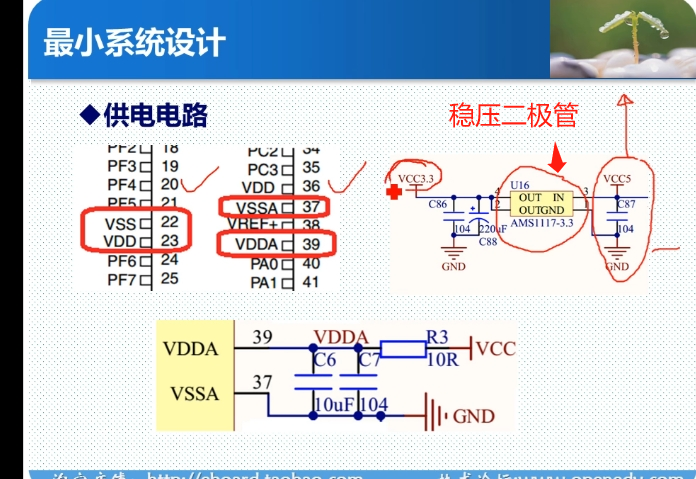
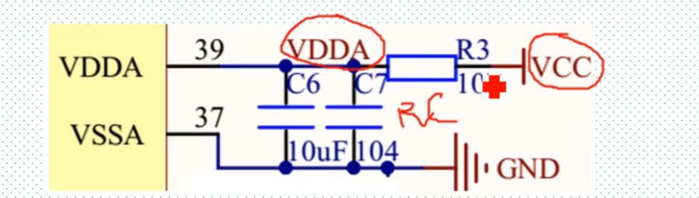

# 参考资料

多轴传感器:

[浅析：智能设备 3轴、6轴、9轴等多轴传感器的区别 (zhihu.com)](https://www.zhihu.com/tardis/sogou/art/589549496)

JTAG通讯协议原理：

[JTAG的作用和原理分析-电子发烧友网 (elecfans.com)](https://m.elecfans.com/article/696779.html)

# MCU最小系统

MCU：Microcontroller Unit的缩写而来，而单词的中文意思是单片微型计算机，简称就是单片机。

MCU最小系统：一个MCU在能正常工作，正常下载程序前提下的最简电路

# STM32最小系统-看原理图

1. 供电
2. 复位
3. 时钟：(外部晶振2个)
4. Boot启动模式选择
5. 下载电路(串口/JTAG/SWD)
6. 后备电池

后备电池其实不是必须的，芯片没有后备电池也能正常下载程序，但一般都会给一个电池

## 供电电路

供电电路包含：

	1. VDD数字电源 +3.3V
	1. VSS数字地 0V
	1. VDDA模拟电源 +3.3V
	1. VSSA模拟地 0V

VDD和VDDA之间一般接一个简单的低通滤波器即可(RC,兀型即可)

**51只有电源和地两种，数字和模拟没有分开，但32分开了**

因为32的主频比较高，为了让数字部分和模拟部分之间的干扰降低，所以选择分开了。

拓展：

​	滤波器：[深入理解滤波器！降噪的底层原理！滤波器到底是什么？_哔哩哔哩_bilibili](https://www.bilibili.com/video/BV1ri4y1y7yG/?spm_id_from=333.337.search-card.all.click&vd_source=f93c8585ef862d160908fb95eb833f84)

通过一个RC低通滤波器滤波器将直流电分为数字电源供电和模拟电源供电

