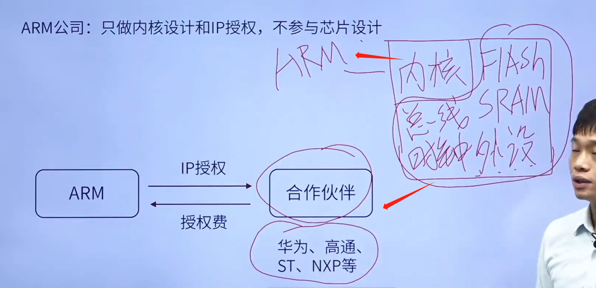
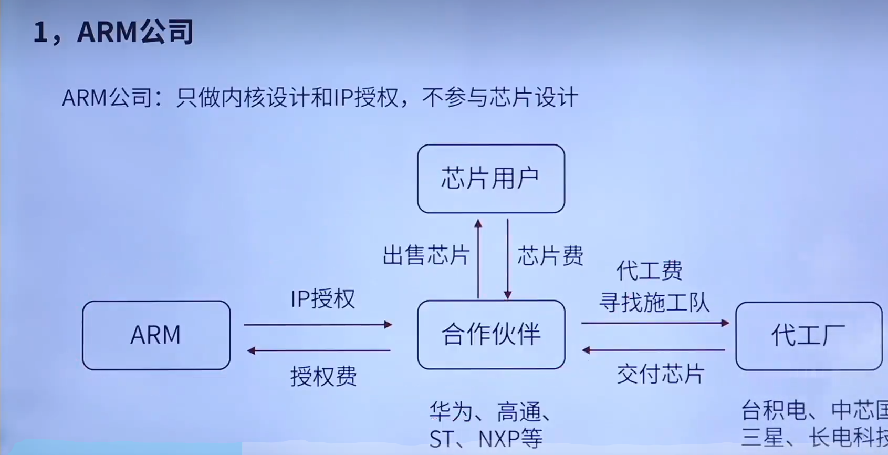
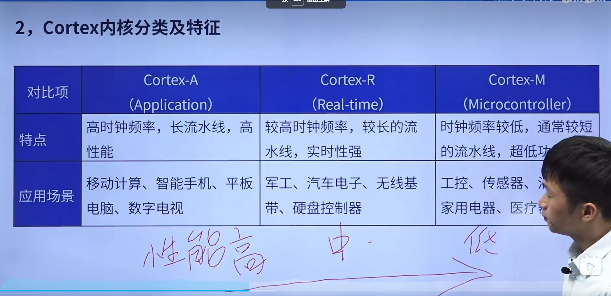
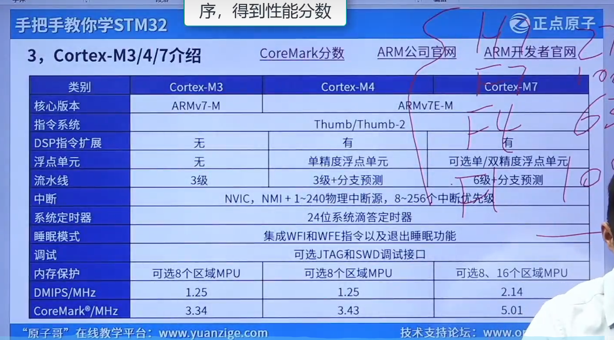

# ARM公司

ARM中的R就是RISC的简写(精简指令集计算机)

# Cortex内核分类及特征

**STM32H743/753**系列产品集成了工作频率高达480 MHz的Arm® Cortex®-M7内核（具有双精度浮点单元）。

# Cortex-M介绍

DMIPS:每秒处理多少百万条指令

CoreMark分数:类似于benchmark分数？测CPU的

都是测主频能力的

