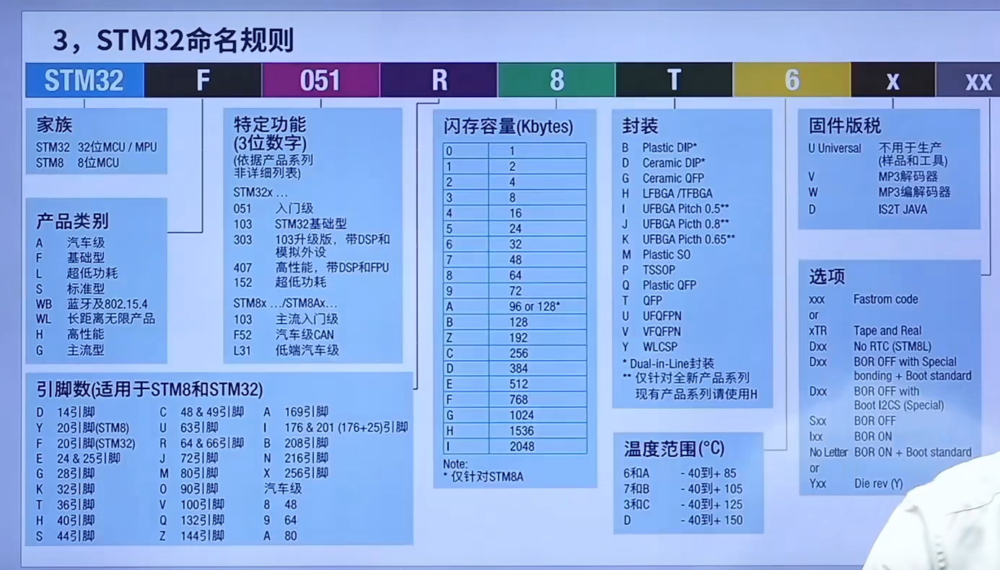

 [初识STM32（课堂总结）.pdf](初识STM32（课堂总结）.pdf) 

# STM32命名规则

我的STM32H743IIT6

高性能-

1. "H7"代表产品系列，此系列基于ARM Cortex-M7内核，工作频率高达480 MHz。
2. “43”表示该款产品的具体型号。

176或201(176+25)个引脚

2048个闪存单元

QFP封装

温度范围-40°到+85°工作温度

# 选型经验

由高到低，由大到小

经验活
