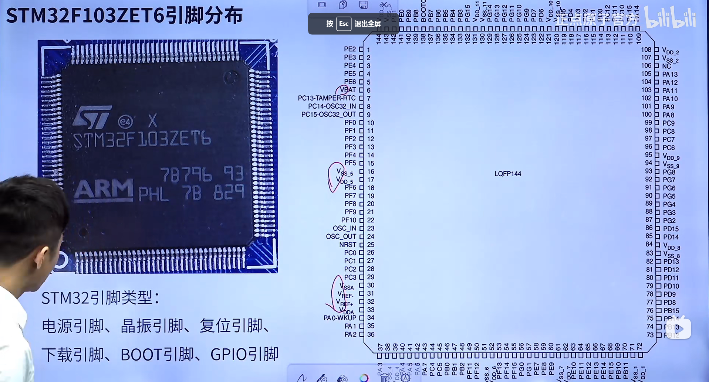
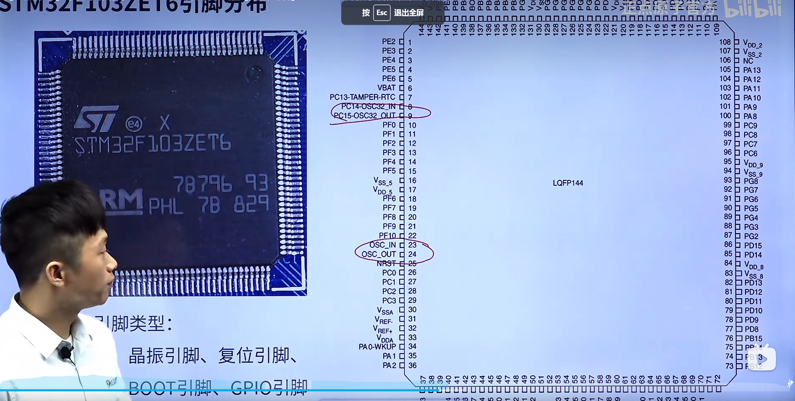
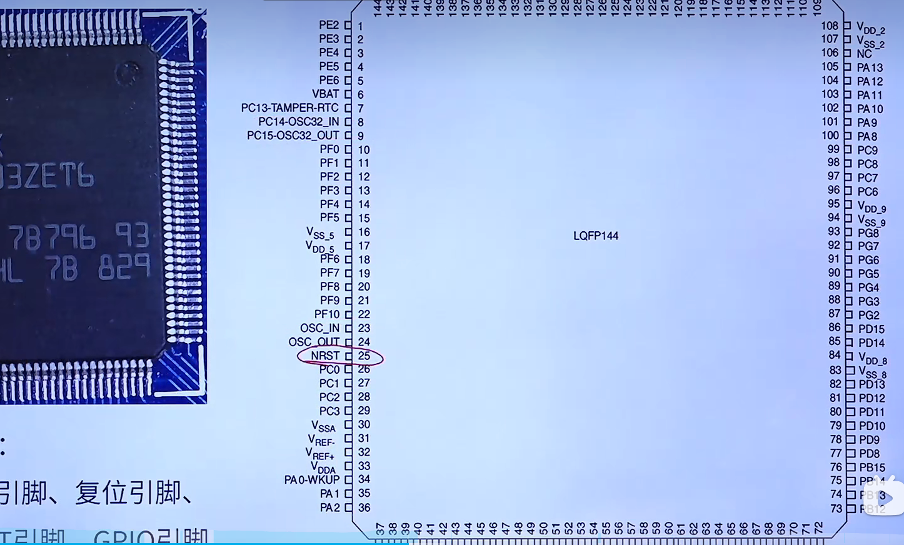
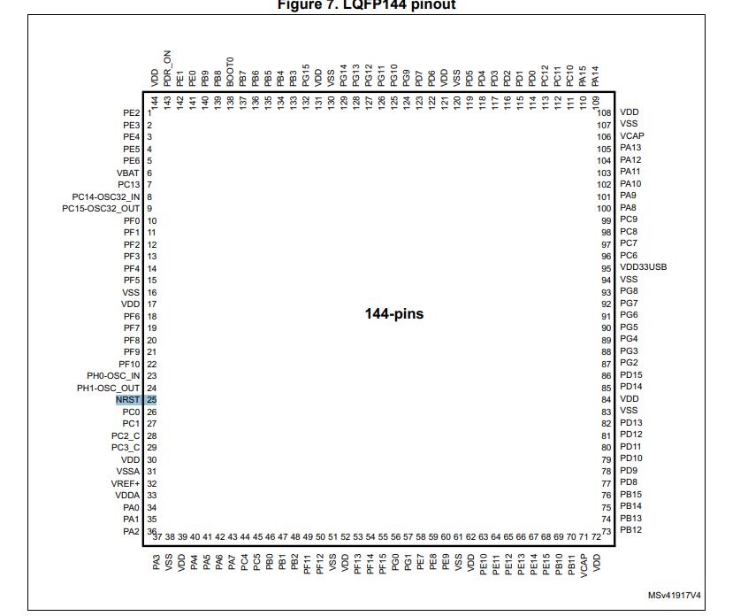
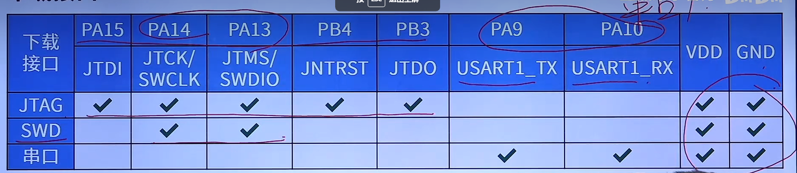
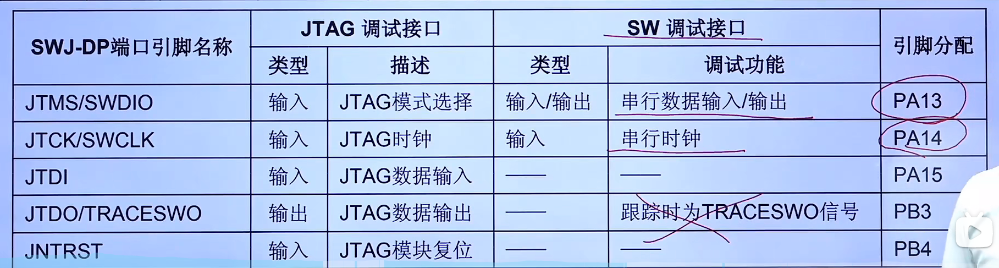
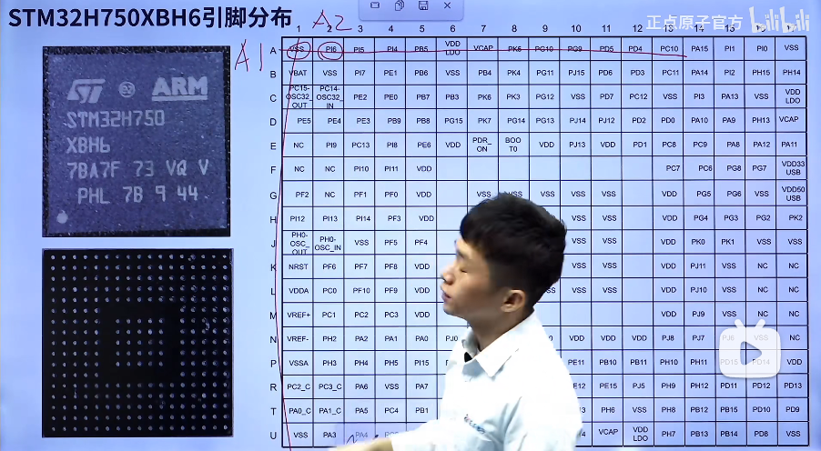
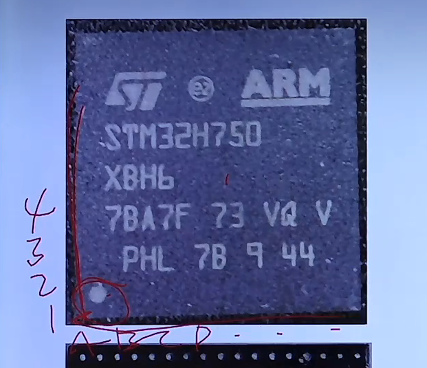
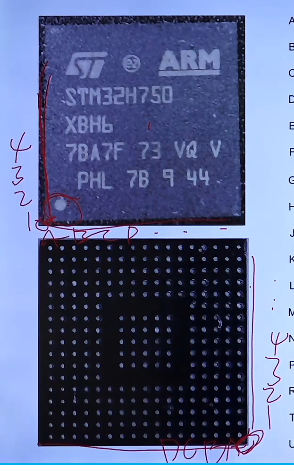

# 引脚类型

电源引脚、晶振引脚、复位引脚、下载引脚、BOOT引脚、GPIO引脚

## 电源引脚

这种带V的一般是电源引脚

## 晶振引脚

比如PC14-OSC32_in和OUT就是低速晶振引脚

OSC_IN和OSC_OUT就是高速晶振引脚

## 复位引脚

比如NRST

## 下载引脚

JTag接口可以仿真、调试、也可以下载 占用5个接口

SWD接口可以下载、也可以仿真、调试 占用两个接口

串口不能下载只能调试

TRACESWO一般是不需要的

# 引脚分布

回想一下51单片机的烧写工具，是不是就是一堆码和字母码，就是这个意思

