 [STM32原理图设计（课堂总结）.pdf](STM32原理图设计（课堂总结）.pdf) 

# 参考资料

多轴传感器:

[浅析：智能设备 3轴、6轴、9轴等多轴传感器的区别 (zhihu.com)](https://www.zhihu.com/tardis/sogou/art/589549496)

JTAG通讯协议原理：

[JTAG的作用和原理分析-电子发烧友网 (elecfans.com)](https://m.elecfans.com/article/696779.html)

# MCU最小系统

首先单片机的设计原则：最小系统+IO分配

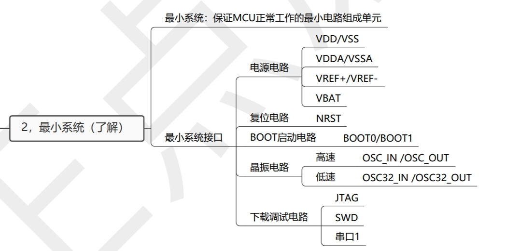

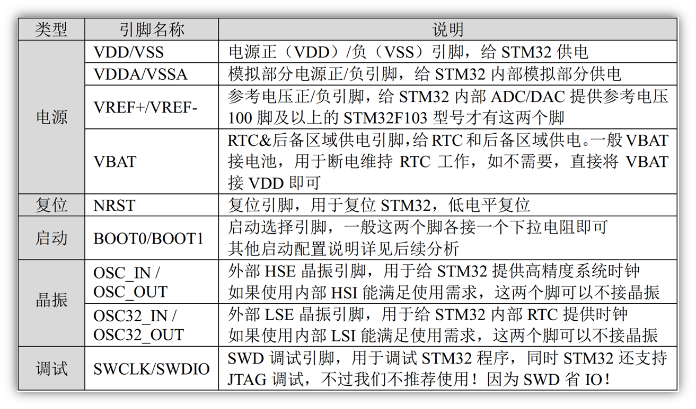

MCU：Microcontroller Unit的缩写而来，而单词的中文意思是单片微型计算机，简称就是单片机。

MCU最小系统：保证MCU正常工作的最小电路组成单元

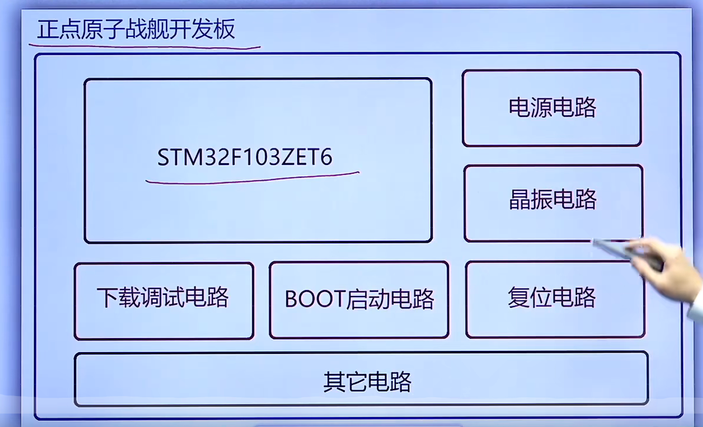

芯片、电源电路、晶振电路、复位电路、BOOT启动电路、下载调试电路、其他电路

## 电源

### 数字电源

VDD正极/VSS负极

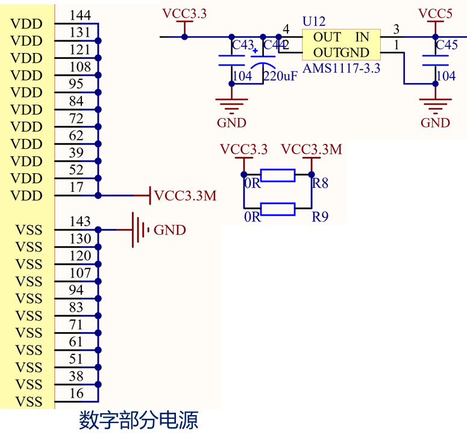

### 模拟电源

模拟电源VDDA+VSSA-

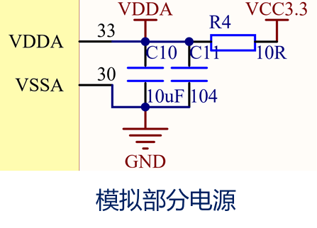

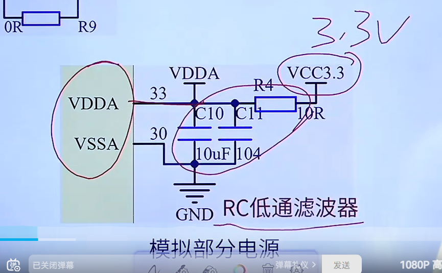

### 参考电压引脚

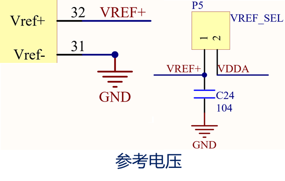

参考电压VREF+/VREF-

当然如果不想直接用模拟电源供电的话，直接外部接到1接口上也是可以的

### RTC&后备电源供电引脚

VBAT 如果断电的话RTC是不会工作的，如果后备区域存储了一些数据也会丢失，所以是给他们供电不让丢失的。

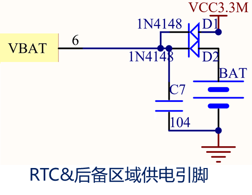

开发板供电走的是3.3v的

如果断电后BAT是3v的纽扣电池，放电给VBAT供电

数字电源和模拟电源之间是有个RC低通滤波器的，不知道滤波器去看参考资料

## 晶振

OSC_IN/OUT是高速的，OSC32_OUT是低速的

### 高速晶振

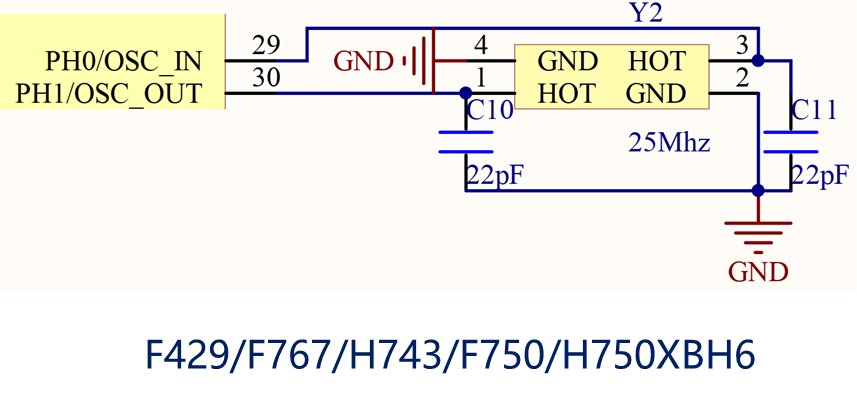

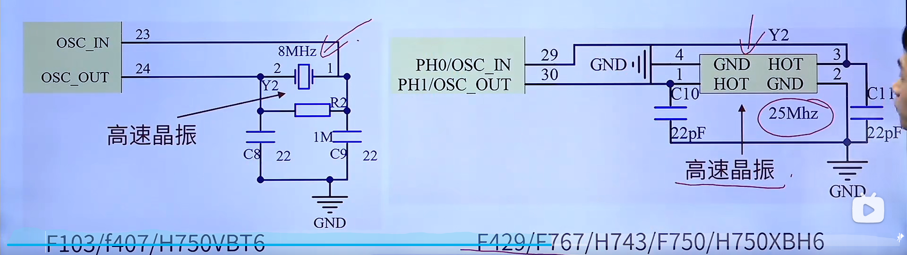

左边的是直插的晶振，右边是贴片的一个晶振，F743的晶振就是贴片的

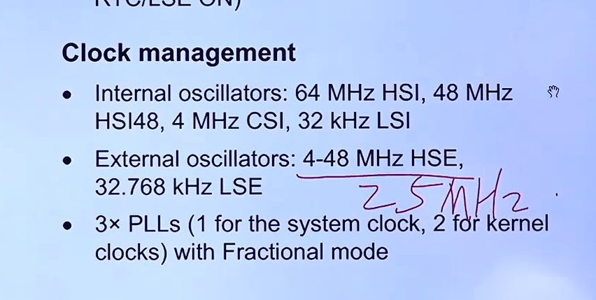

### 低速晶振

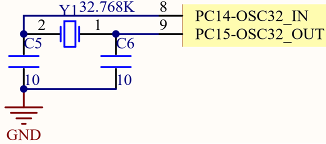

# 复位电路

## 按键复位

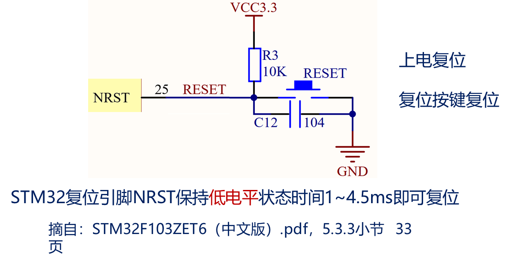

NRST保持低电平状态1-4.5ms即可复位

## 上电复位

上电的时候先给电容充电，此时是NRST是低电平

电容充满电后，是高电平，NRST变为高电平

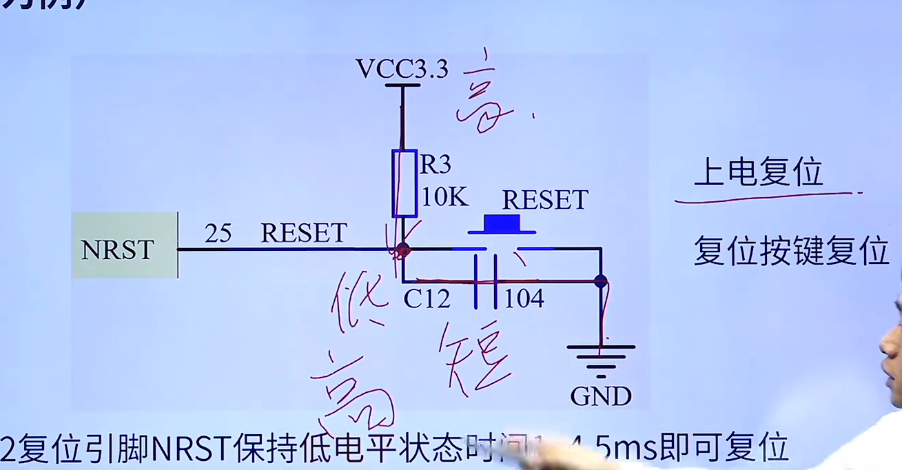

# boot启动电路

不通电时是一个下拉电阻

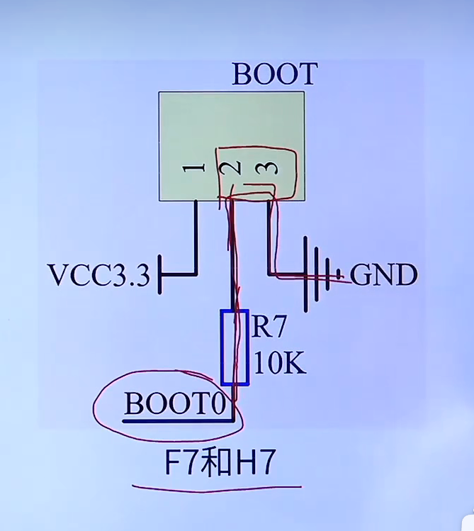

boot启动时候接到上面

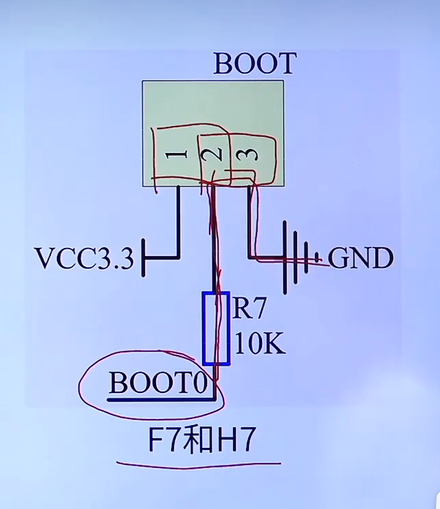

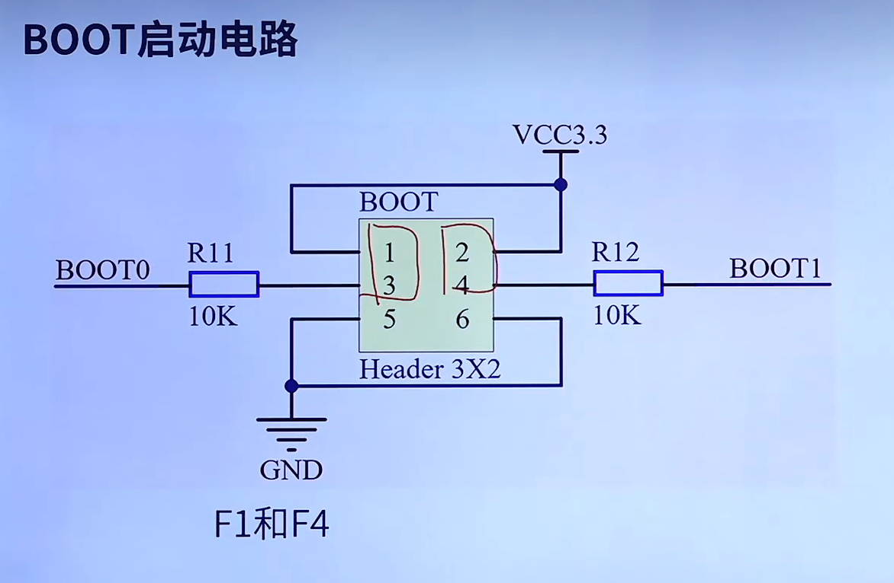

# 下载调试电路

## SWD

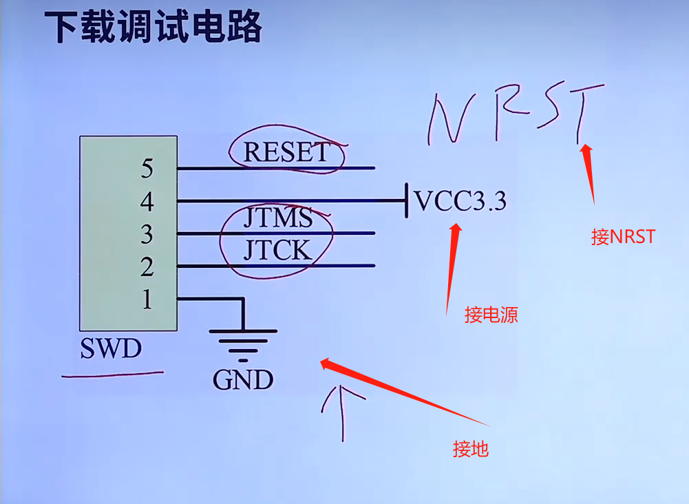

## JTAG

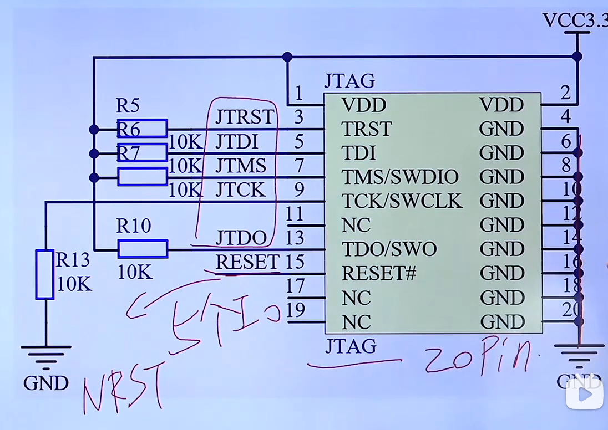

## 一键下载电路

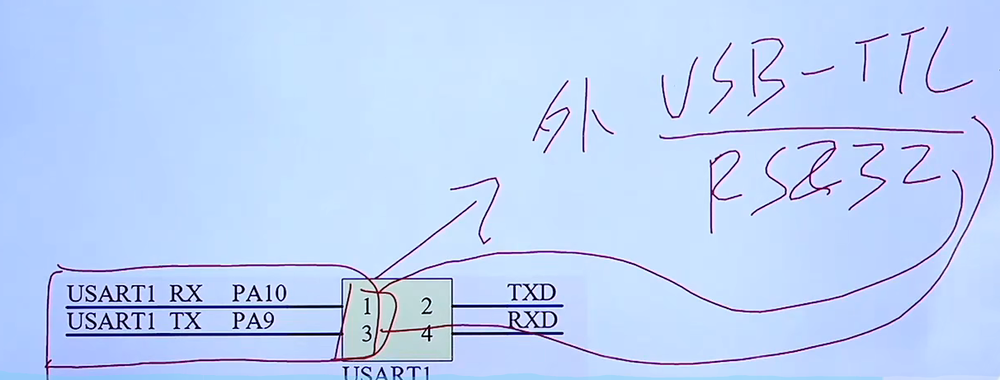

# IO分配

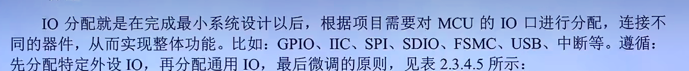

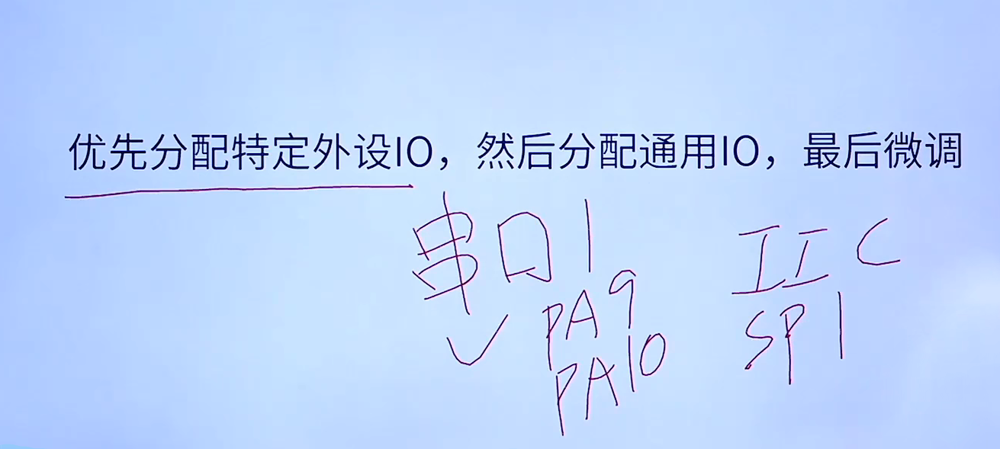