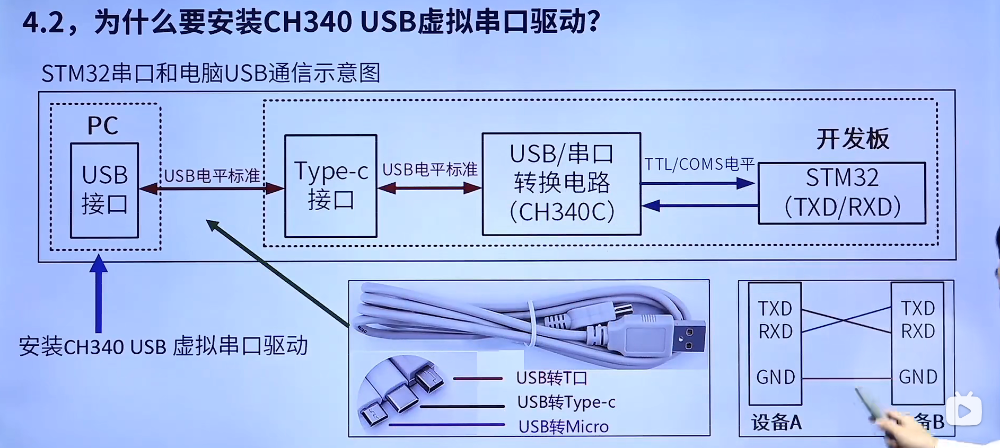

# 常用开发工具

| 工具              | 名称     | 所属公司                    | 说明                                     |
| ----------------- | -------- | --------------------------- | ---------------------------------------- |
| 集成开发环境(IDE) | **MDK**  | Keil                        | STM32最常用的集成开发环境，简单易用      |
| EWARM             | IAR      | 支持STM32开发，用的人少一些 |                                          |
| 仿真器            | **DAP**  | ARM                         | 开源、免驱、带虚拟串口功能、速度快、廉价 |
| STLINK            | ST       | 支持全面、稳定、廉价        |                                          |
| JLINK             | Segger   | 稳定、高速、价格贵          |                                          |
| 串口调试助手      | **XCOM** | 正点原子                    | 功能多、稳定、简单易用                   |
| SSCOM             | 丁丁     | 稳定、小巧、简单易用        |                                          |

不同MDK版本的支持情况：https://www2.keil.com/mdk5/selector

## 下载地址

MDK软件下载：https://www.keil.com/download/product/

器件支持包下载：https://www.keil.com/dd2/pack/

# 为什么要安装ch340 USB串口驱动

CH340C可以实现将USB电平转化为TTL/COMS电平给开发板传输/供电

但PC段没有识别CH340的能力，需要通过虚拟串口驱动识别

# USB虚拟串口的作用

注意STM32只能用USB串口1来下载程序，其他都不行

[STM32 为什么只能串口1-UART1下载程序_only_a_Heroic_car的博客-CSDN博客](https://blog.csdn.net/only_a_Heroic_car/article/details/130097242)