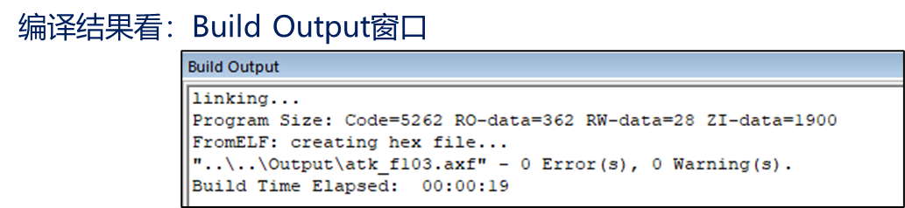

# 课堂总结

 [STM32初体验.pdf](STM32初体验.pdf) 

# 部分编译和全局编译

部分编译：如果工程没有编译过，第一次编译是等同于全局编译的效果，但之前编译过的话，只编译与当前文件相关的编译

全局编译：所有工程都编译，耗费时间长

# 编译结果：Build Output窗口

图里Flash占用是前三个相加=5262+362+28

SRAM占用=28+1900

| 数据类型 | 占用Flash or SRAM | 说明                                 |
| -------- | ----------------- | ------------------------------------ |
| Code     | Flash             | 代码                                 |
| RO-Data  | Flash             | 只读数据，一般是指 const  修饰的数据 |
| RW-Data  | Flash and SRAM    | 初值为非 0的可读可写数据             |
| ZI-Data  | SRAM              | 初值为0  的可读可写数据              |

当然占用了多少Flash和占用了多少个SRAM 可以用后续的.map文件查询

当且仅当0错误才会创建Hex文件，hex文件在工程的OUTPUT文件夹下

而.HEX文件才是供我们开发板下载到里面的文件

**注意5.37版本后不再带ArmCompiler5的编译器了 所以要自行下载老版本编译器**

[Legacy Arm Compiler 5, 4.1, and RVCT (ACOMP5)](https://developer.arm.com/downloads/view/ACOMP5)