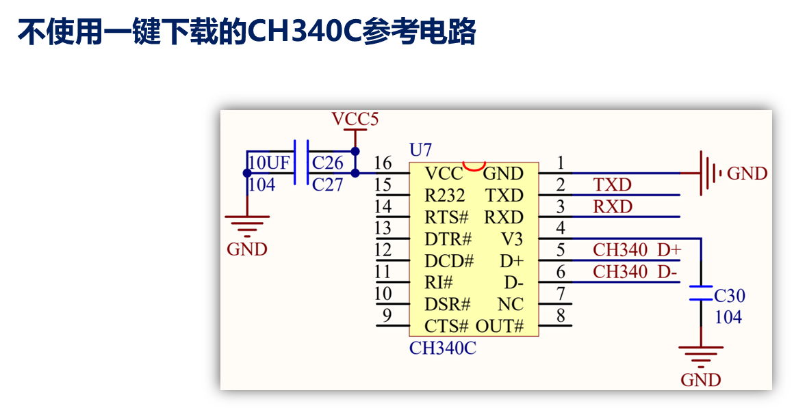
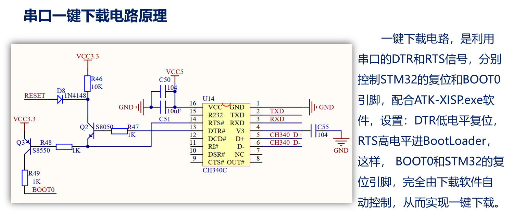

# 课堂总结

 [STM32初体验.pdf](STM32初体验.pdf) 

# 部分编译和全局编译

部分编译：如果工程没有编译过，第一次编译是等同于全局编译的效果，但之前编译过的话，只编译与当前文件相关的编译

全局编译：所有工程都编译，耗费时间长

# 编译结果：Build Output窗口

图里Flash占用是前三个相加=5262+362+28

SRAM占用=28+1900

| 数据类型 | 占用Flash or SRAM | 说明                                 |
| -------- | ----------------- | ------------------------------------ |
| Code     | Flash             | 代码                                 |
| RO-Data  | Flash             | 只读数据，一般是指 const  修饰的数据 |
| RW-Data  | Flash and SRAM    | 初值为非 0的可读可写数据             |
| ZI-Data  | SRAM              | 初值为0  的可读可写数据              |

当然占用了多少Flash和占用了多少个SRAM 可以用后续的.map文件查询

map双击当前工程的文件夹

当且仅当0错误才会创建Hex文件，hex文件在工程的OUTPUT文件夹下

而.HEX文件才是供我们开发板下载到里面的文件

**注意5.37版本后不再带ArmCompiler5的编译器了 所以要自行下载老版本编译器**

[Legacy Arm Compiler 5, 4.1, and RVCT (ACOMP5)](https://developer.arm.com/downloads/view/ACOMP5)

# ISP在线系统调试

STM32的ISP下载，常用串口1来下载

因为使用的是USB虚拟串口，所以事先得安装CH340USB虚拟串口驱动(搭配开发环境)

注意PA9是TX引脚 PA10是RX引脚 所以是用短路帽相连以达到错位的效果

# STM32的启动模式

X表示任意

主闪存存储器作为启动区域一般是0X0800 0000 启动地址

第二种是ISP下载 0 1

第三种用的比较少 一般用于调试

每一种支持的串口是不一样的，比如我的STMH743是这个

3个串口、3个IIC、三个SPI加一个设备模式下的USB OTG FS(就是usb)

# ISP下载程序步骤

DTR低和RST高的本质上是BOO1低BOOT0高

所以在没有一键下载电路的时候要通过上述步骤完成ISP下载

没有一键下载电路的时候 RTS和DTR是没有连接任何电路的。

这个是人家的专利奥别乱用

# 程序执行一般步骤

