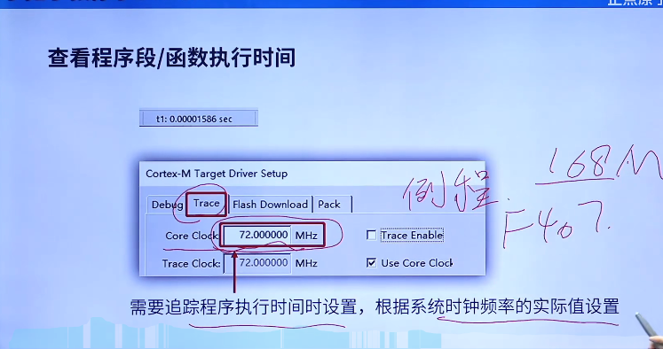
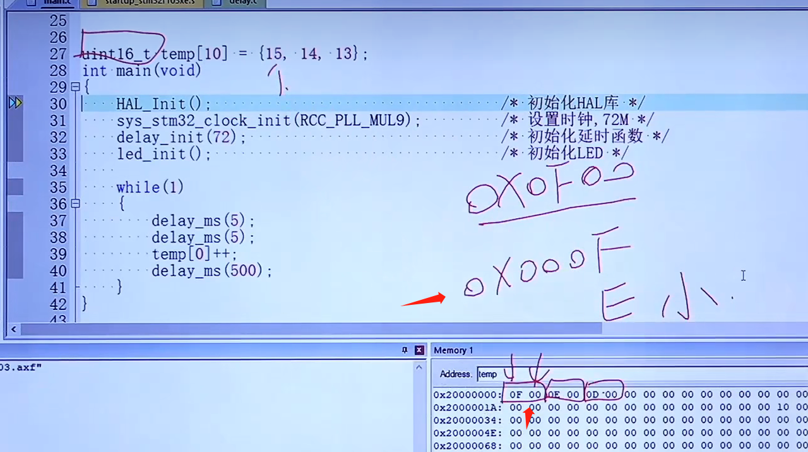
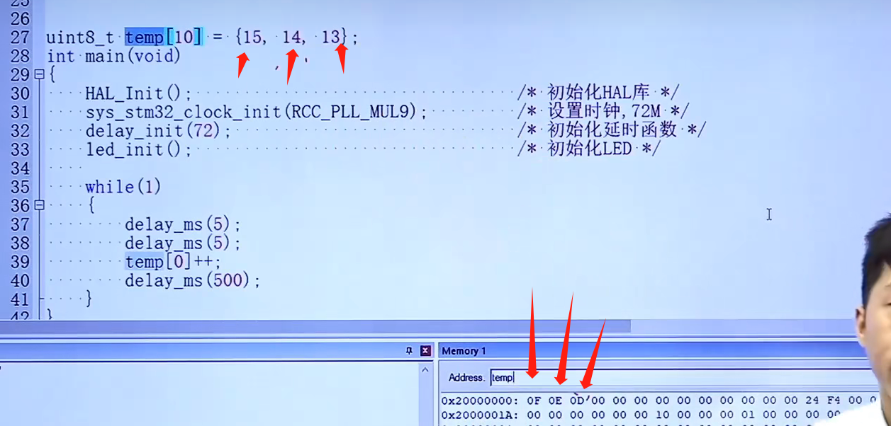
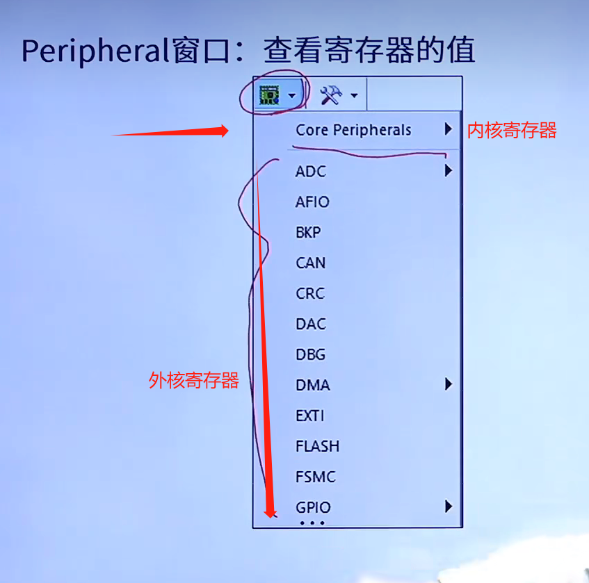
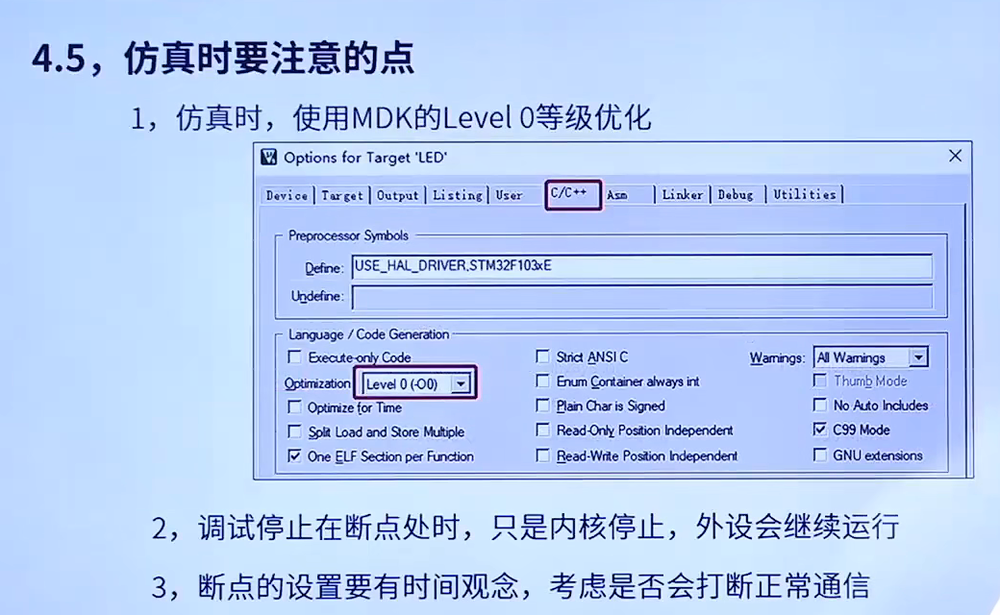
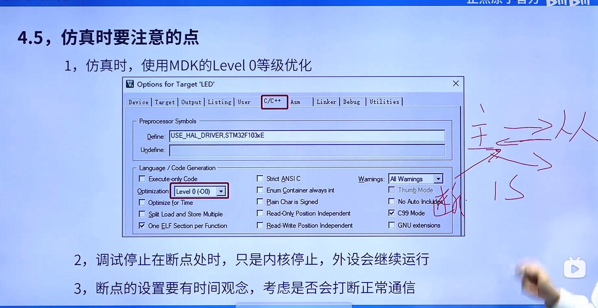

# 预备知识

​	防呆（日语：ポカヨケ；英语：Fool-proofing）:是一种预防矫正的行为约束手段，运用避免产生错误的限制方法，让操作者不需要花费注意力、也不需要经验与专业知识即可直接无误地完成正确的操作。在[工业设计](https://baike.baidu.com/item/工业设计/82669?fromModule=lemma_inlink)上，为了避免使用者的操作失误造成机器或人身伤害（包括无意识的动作或[下意识](https://baike.baidu.com/item/下意识/1008888?fromModule=lemma_inlink)的[误动作](https://baike.baidu.com/item/误动作/10087227?fromModule=lemma_inlink)或不小心的肢体动作），会有针对这些可能发生的情况来做[预防措施](https://baike.baidu.com/item/预防措施/9704253?fromModule=lemma_inlink)，称为防呆。例如常见的手机[SIM卡](https://baike.baidu.com/item/SIM卡/449605?fromModule=lemma_inlink)，**有一个缺角，这种有特殊的设计就是防呆缺口**，如果你插反了，就插不下去，防止新手误操作将SIM卡插反。

# JTAG/SWD调试原理概述

最好用SW调试 因为只用两个接口就可以完成这个功能

# SWJ-DP引脚分配

F1系列可以通过AFIO_MAPR寄存器的SWJ_CFG[2:0]位来释放部分或者全部SWJ-DP引脚

F4/F7/H7系列默认全部SWJ-DP引脚为复用功能并映射到复用功能0（AF0）

SWJ是用来控制JTAG/SWD调试的端口，不是下载哦

# 断点

MDK最多支持6个断电 第七个就提示了

# 时钟

属于添加进芯片的事件，仿真出程序所需要的事件，和51的11.0592很像哎，他不是实际值，是在MDK5里仿真出来的值。

注意全局变量不给值默认是0X00

# Memory窗口注意

M3/M4/M7是小端模式：低字节高位，高字节地位

比如下面的uint16，15本来应该是0X000F，但是寄存器里是0X0F00，所以必须要倒着读，如果改成32位就是四个地址一个数，实际内存里的存储方式是：

0X0F 00 00 00  但是读出来15应该反过来读 0X 00 00 00 0F

如果用Char类型是看不出来的

# Peripheral窗口

# 仿真时要注意的点

1.仿真时，使用MDK的Level0等级优化

如果不选择Level0可能会出现变量在监控那一栏里面出现No In Scope

2，调试停止在断点处停止，只是内核停止，外设会继续运行

3，断电的设置要有事件观念，考虑是否会打断正常通信

比如说某个通讯协议，你把断电设置在返回握手上，但其实从机是需求在多少秒内发送过去一次握手建立连接的，你断电超时了后续的连接就建立失败了，会打断通讯影响后续操作。

