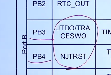

# 预备知识

​	防呆（日语：ポカヨケ；英语：Fool-proofing）:是一种预防矫正的行为约束手段，运用避免产生错误的限制方法，让操作者不需要花费注意力、也不需要经验与专业知识即可直接无误地完成正确的操作。在[工业设计](https://baike.baidu.com/item/工业设计/82669?fromModule=lemma_inlink)上，为了避免使用者的操作失误造成机器或人身伤害（包括无意识的动作或[下意识](https://baike.baidu.com/item/下意识/1008888?fromModule=lemma_inlink)的[误动作](https://baike.baidu.com/item/误动作/10087227?fromModule=lemma_inlink)或不小心的肢体动作），会有针对这些可能发生的情况来做[预防措施](https://baike.baidu.com/item/预防措施/9704253?fromModule=lemma_inlink)，称为防呆。例如常见的手机[SIM卡](https://baike.baidu.com/item/SIM卡/449605?fromModule=lemma_inlink)，**有一个缺角，这种有特殊的设计就是防呆缺口**，如果你插反了，就插不下去，防止新手误操作将SIM卡插反。

# JTAG/SWD调试原理概述

最好用SW调试 因为只用两个接口就可以完成这个功能

# SWJ-DP引脚分配

F1系列可以通过AFIO_MAPR寄存器的SWJ_CFG[2:0]位来释放部分或者全部SWJ-DP引脚

F4/F7/H7系列默认全部SWJ-DP引脚为复用功能并映射到复用功能0（AF0）

SWJ是用来控制JTAG/SWD调试的端口，不是下载哦

