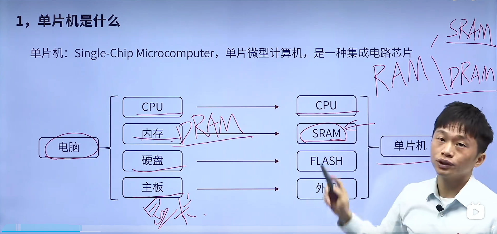
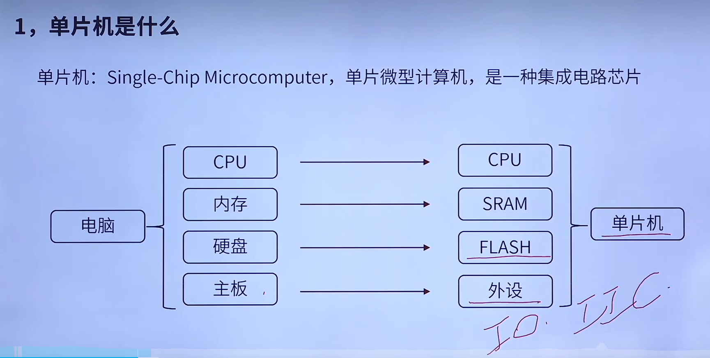
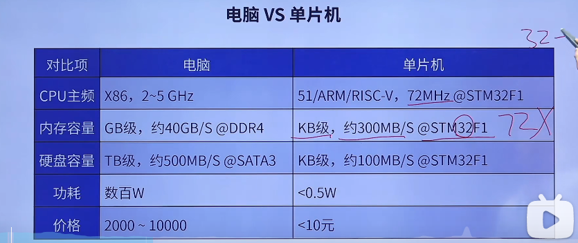
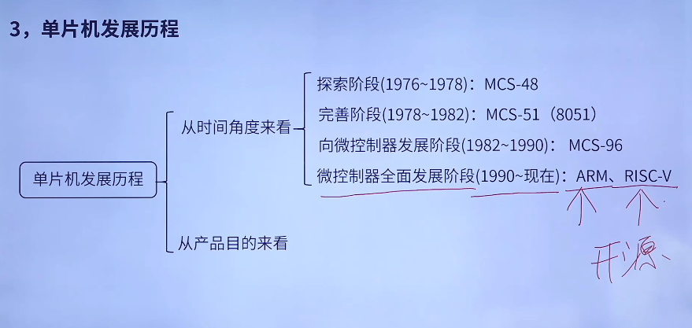
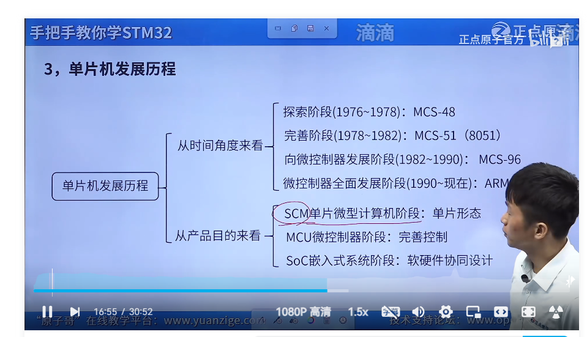
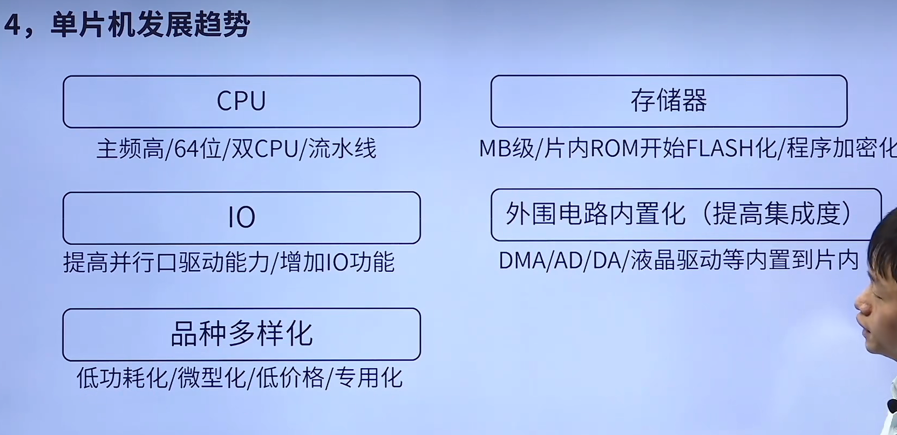
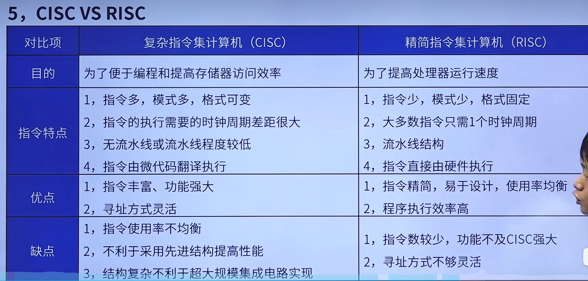
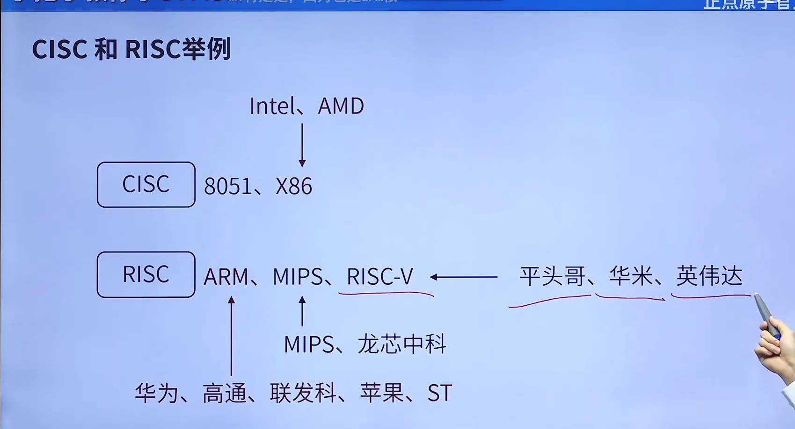
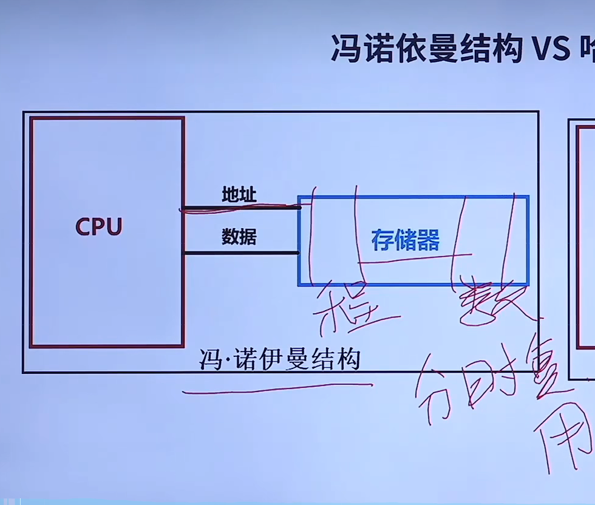
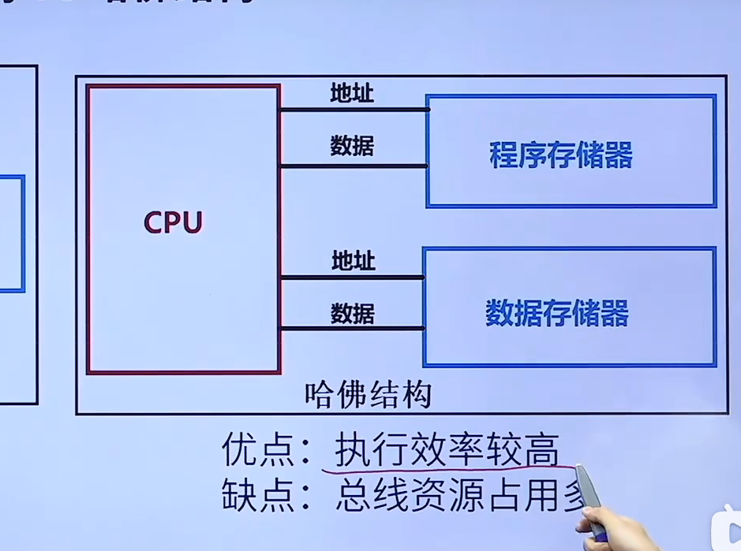

了解：知道是什么东西

熟悉：朋友

掌握：亲人

# 单片机是什么

Single-Chip Microcomputer 单片微型计算机，是一种集成电路芯片

## SRAM和DRAM

RAM（随机存取存储器）可分为静态存储器（Static Random Access Memory,SRAM）和动态存储器（Dynamic Random Access Memory,DRAM）。这两种内存类型在内部结构和工作原理上有着显著的不同。

SRAM中的存储单元相当于一个锁存器，只有两种稳态：0和1。由于采用了稳定的存储电路，每个存储单元需要更多的晶体管来实现，通常每个存储单元需要6个晶体管。这使得SRAM的存储密度相对较低，但由于其读写速度快，非常稳定，所以常被用作计算机的缓存。

相反，DRAM采用电容存储电荷来保存数据的0和1两种状态。这种方式使得每个存储单元只需要一个电容和一个访问晶体管，因此DRAM的存储密度较高。然而，由于电容中存储的电荷会随着时间的推移逐渐减少，DRAM需要定期进行刷新操作，以维持其中的数据。这使其速度相对较慢，但造价更低，容量也比SRAM大得多，故在计算机中主要用作主存。

总的来说，SRAM和DRAM各有优缺点。SRAM速度快、稳定性好，但成本高、存储密度低；而DRAM虽然速度较慢，但其成本低、存储密度高，因此在实际应用中两者通常会同时使用，以满足不同的需求。

## 外设

IO/IIC 接口 LCD

## 内存容量的读写速度计算公式

以F1为例

72是主频 STM32是32位的，要换算成字节也就是4字节，所以最终的计算结果是

72×4=288 接近300MB/S
$$
主频频率×(多少位的寄存器换算成字节)
$$

## 功耗

芯片的额定电流(150mA)×最大电流(3.3v)=0.49W

# 单片机的特点

体积小、功耗低、集成度高(IO/TIM/DA/AD)、使用方便(C/Debug)、扩展灵活(IIC/SPI/FSMC)

# 单片机的作用

 仪表仪器(电源/示波器/焊台)

家用电器(空调、冰箱、洗衣机)

工业控制(机器人/PLC/电梯)

汽车电子(GPS、ABS、胎压检测)

# 单片机的发展历程

# 单片机未来趋势

## 指令流水线

指令流水线是一种准并行处理实现技术，它将一个重复的时序过程分解成若干个子过程，每个过程都可有效地在其专用功能段上与其他子过程同时执行。在流水线中，每个子过程由专用的功能段实现，各个功能段所需时间应尽量相等，否则，时间长的功能会造成流水线的“堵塞”和“断流”，这个时间一般为一个时钟周期（拍）或机器周期。

流水线技术只需增加少量硬件就能把计算机运行速度提高几倍，故而广泛用于并行处理。然而，影响流水线性能的因素有很多，例如资源冲突、数据冲突和控制冲突等。

流水线的性能指标主要是吞吐率，即单位时间内完成的指令数。为了进一步提高流水线的性能，人们还提出了超标量流水线技术和超流水线技术等方法

# CISC 与RISC

# 冯诺依曼架构

优点：总线资源占用少

缺点：执行效率较低

# 哈佛结构

优点：执行效率高，可以在运行程序的同时读取数据(因为数据/程序存储器都有自己的地址)

缺点：总线资源占用多

